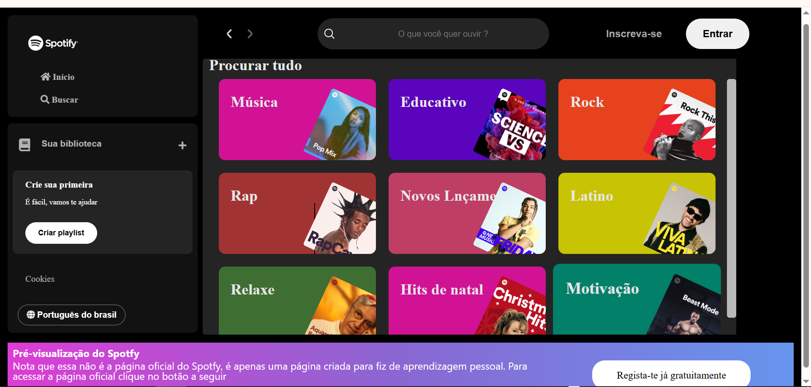

# 🎵 Spotify Clone  

Este é um projeto de clone do Spotify, recriando a interface e algumas funcionalidades da plataforma de streaming de música mais popular do mundo. O objetivo deste projeto é praticar habilidades de desenvolvimento front-end e back-end, utilizando tecnologias modernas.  

## 🚀 Tecnologias utilizadas  
- HTML, CSS, JavaScript    
- API do Spotify  

## 📸 Prévia do Projeto  
Aqui está uma prévia de como ficou o projeto:  

  

## 📂 Como executar o projeto  
1. Clone este repositório:  
   ```sh
   git clone https://github.com/seu-usuario/spotify-clone.git
